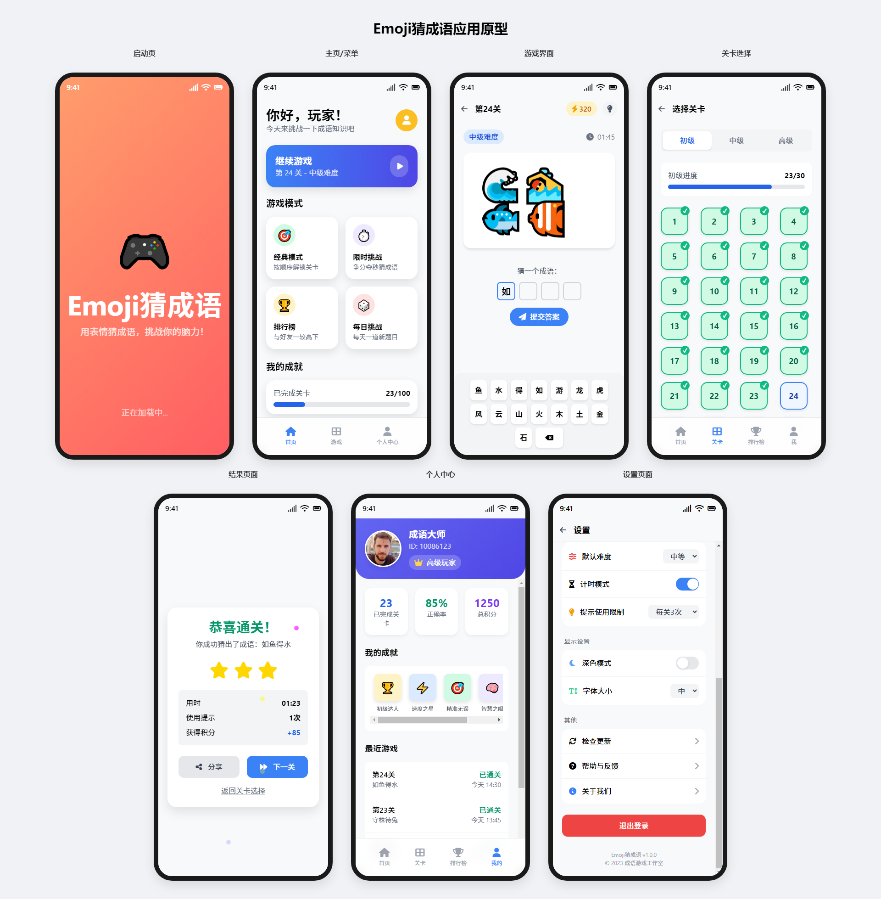

# Emoji猜成语



## 📝 项目简介

Emoji猜成语是一款有趣的HTML5网页游戏，将现代表情符号与中国传统成语相结合。玩家需要通过解读屏幕上显示的emoji表情组合，猜测对应的中国成语。这款游戏既能娱乐放松，又能学习中国传统文化知识，适合各个年龄段的用户。

## ✨ 特色功能

- 🎮 **丰富的游戏关卡**：多个难度级别的成语谜题
- 🏆 **成就系统**：完成挑战解锁成就
- 📊 **个人资料**：记录游戏进度和统计数据
- 🔊 **音效反馈**：生动的游戏音效提升游戏体验
- 📱 **响应式设计**：完美支持手机、平板和电脑等多种设备
- 🌙 **界面美观**：简洁直观的用户界面设计

## 🚀 在线体验

[点击这里体验游戏](https://your-game-url.com)

## 🛠️ 技术栈

- HTML5
- CSS3 (Tailwind CSS)
- JavaScript (原生)
- Font Awesome 图标

## 📂 项目结构

```
emoji-guess-word/
├── assets/             # 资源文件
│   ├── css/            # 样式文件
│   ├── images/         # 图片资源
│   ├── js/             # JavaScript文件
│   └── sounds/         # 音效文件
├── idea/               # 设计原型
├── pages/              # 页面文件
│   ├── game.html       # 游戏主页面
│   ├── home.html       # 首页
│   ├── levels.html     # 关卡选择页
│   ├── profile.html    # 个人资料页
│   ├── result.html     # 结果页面
│   ├── settings.html   # 设置页面
│   └── splash.html     # 启动页面
└── index.html          # 入口页面
```

## 📋 安装与使用

### 本地运行

```bash
# 克隆仓库
git clone https://github.com/Caron77ai/emoji-guess-word

# 进入项目目录
cd emoji-guess-word

# 使用本地服务器运行项目
# 可以使用 Live Server、http-server 等工具
```

### 部署到服务器

将所有文件上传到您的网站服务器即可。本项目是纯前端应用，不需要特殊的服务器环境。

## 🎮 游戏玩法

1. 点击"开始游戏"进入游戏
2. 观察屏幕上显示的emoji表情组合
3. 根据表情提示，在输入框中输入对应的中国成语
4. 答对获得积分，解锁更多关卡
5. 挑战自我，完成所有关卡！

## 🤝 贡献指南

欢迎为Emoji猜成语项目做出贡献！您可以通过以下方式参与：

1. 报告bug或提出改进建议
2. 提交新的成语和emoji组合


## 📄 许可证

本项目采用 MIT 许可证 - 详情请参阅 [LICENSE](LICENSE) 文件

## 📞 联系方式

- 作者：[Caron77ai]
- Twitter：[https://x.com/Caron7_7]
- 项目链接：[https://github.com/Caron77ai/emoji-guess-word]

---

## 🙏 致谢

- 感谢所有为项目做出贡献的开发者
- [Tailwind CSS](https://tailwindcss.com/) 提供的UI框架支持
- [Font Awesome](https://fontawesome.com/) 提供的图标资源

---

如果您喜欢这个项目，请给它一个⭐️！
